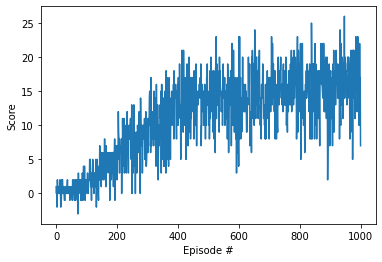

# Project 1 Report

### Introduction

In this project, I trained an agent to navigate (and collect bananas!) in a large, square world.  

A reward of +1 is provided for collecting a yellow banana, and a reward of -1 is provided for collecting a blue banana. Thus, the goal of the agent is to collect as many yellow bananas as possible while avoiding blue bananas.  

The state space has 37 dimensions and contains the agent's velocity, along with ray-based perception of objects around agent's forward direction. Given this information, the agent has to learn how to best select actions.

The task is episodic, and in order to solve the environment, the agent need get an average score of +13 over 100 consecutive episodes.

### Learning Algorithm

At the core of this program is the Q-learning algorithm,

$$Q\left(S_{t}, A_{t}\right) \leftarrow Q\left(S_{t}, A_{t}\right)+\alpha\left(R_{t+1}+\gamma \max _{a \in \mathcal{A}} Q\left(S_{t+1}, a\right)-Q\left(S_{t}, A_{t}\right)\right).$$

Here, we uses a neural netowrk to approximate the optimal state-action value function, i.e. $Q(s,a)$. The neural network has 2 fully connected hidden layers, each of them consisting of 64 nodes, and the activation functions used are ReLu.

We also incorporate other ingredients to improve the performance of the algorithm, including 𝛆-greedy algorithm, experience replay, and others. Details can be found in the code.

### Plot of Rewards

The rewards generated during the training process are plotted below:

It can be seen that after 400 episodes of training, the average rewards started to converge. Actually, the average rewards between episode 401 and 500 is 13.30, exceeding the target 13.0. Hence, after about 400 episodes of training, we have solved the problem. 

### Watch a Game Video

Watch a Youtube video on how the trained AI agent performs in a real game: https://youtu.be/Enqqr-YKaEw

### Ideas for Future Work

In this project, I implemented a basic version of deep Q-learning. There are multiple ways to improve the performance:

1. The easiest way is to increase the number of neural network layers and the number of nodes in each layer, or fine-tune other hyper parameters within the current architecture.
2. Double DQN
3. Dueling DQN
4. Prioritized Experience Replay

