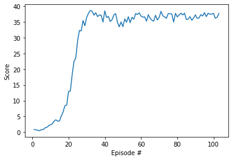

# Project 2 Report

### Introduction

For this project, I work with the [Reacher](https://github.com/Unity-Technologies/ml-agents/blob/master/docs/Learning-Environment-Examples.md#reacher) environment.

In this environment, a double-jointed arm can move to target locations. A reward of +0.1 is provided for each step that the agent's hand is in the goal location. Thus, the goal of the agent is to maintain its position at the target location for as many time steps as possible.

The observation space consists of 33 variables corresponding to position, rotation, velocity, and angular velocities of the arm. Each action is a vector with four numbers, corresponding to torque applicable to two joints. Every entry in the action vector should be a number between -1 and 1.

### Learning Algorithm

The algorithim I chose for this project is the Deep Deterministic Policy Gradient (DDPG) algorithm. The python implementation is based on Udacity's [ddpg-pendulum](https://github.com/udacity/deep-reinforcement-learning/tree/master/ddpg-pendulum) project.

### Plot of Rewards

The rewards generated during the training process are plotted below:

It can be seen that after 400 episodes of training, the average rewards started to converge. Actually, the average rewards between episode 401 and 500 is 13.30, exceeding the target 13.0. Hence, after about 400 episodes of training, we have solved the problem. 

### Watch a Game Video

Watch a Youtube video on how the trained AI agent performs in a real game: https://youtu.be/Enqqr-YKaEw

### Ideas for Future Work

In this project, I implemented a basic version of deep Q-learning. There are multiple ways to improve the performance:

1. The easiest way is to increase the number of neural network layers and the number of nodes in each layer, or fine-tune other hyper parameters within the current architecture.
2. Double DQN
3. Dueling DQN
4. Prioritized Experience Replay

### Watch the Video

Watch two Youtube videos on the arms' preformance before training https://youtu.be/DCdfgryCy7M and after training https://youtu.be/Hpm5g2yC9SU.