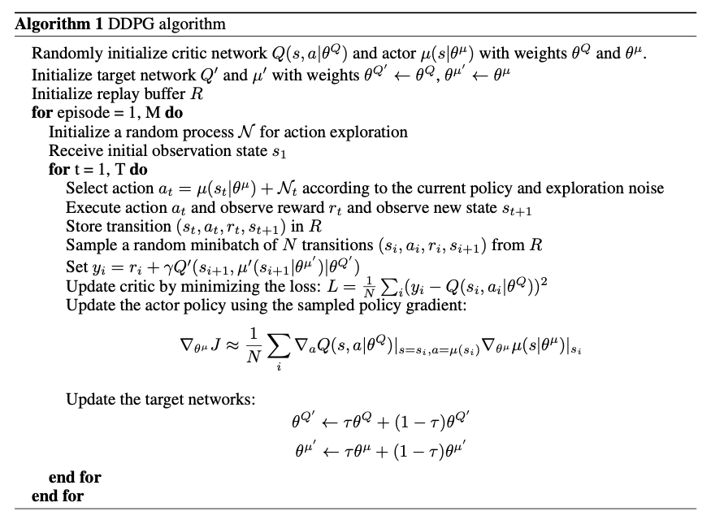
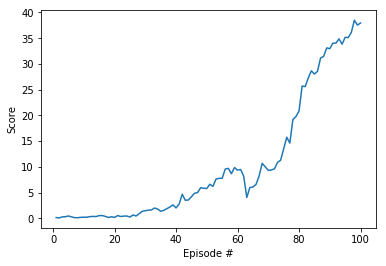
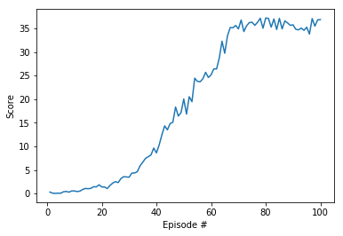
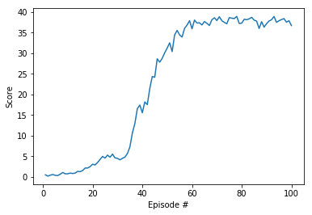

# Project 2 Report

### Introduction

For this project, I work with the [Reacher](https://github.com/Unity-Technologies/ml-agents/blob/master/docs/Learning-Environment-Examples.md#reacher) environment.

In this environment, a double-jointed arm can move to target locations. A reward of +0.1 is provided for each step that the agent's hand is in the goal location. Thus, the goal of the agent is to maintain its position at the target location for as many time steps as possible.

The observation space consists of 33 variables corresponding to position, rotation, velocity, and angular velocities of the arm. Each action is a vector with four numbers, corresponding to torque applicable to two joints. Every entry in the action vector should be a number between -1 and 1.

### Learning Algorithm

The algorithim I chose for this project is the Deep Deterministic Policy Gradient (DDPG) algorithm: 

More details can be found from [the orinial paper](https://arxiv.org/abs/1509.02971), and the python implementation is based on Udacity's [ddpg-pendulum](https://github.com/udacity/deep-reinforcement-learning/tree/master/ddpg-pendulum) project.

#### Neural Network Architecture 

The actor network has two hidden layers, where the 1st layer has 400 nodes and the 2n layer has 300 nodes. The critic network has a very sililar structure as the actor nework. The activation functions are all ReLus. 

The networks used here are the same as in [ddpg-pendulum](https://github.com/udacity/deep-reinforcement-learning/tree/master/ddpg-pendulum). I did some experiments on changing the structures; however, the performances were similar.

#### Hyperparameters 

The key hyperparameters in mine benchmark implementation are as follows:

| Hyperparameter            | Value  |
| ------------------------- | ------ |
| Replay buffer size        | 1e5    |
| Batch size                | 128    |
| GAMMA (discount factor)   | 0.99   |
| TAU                       | 1e-3   |
| Actor learning rate       | 1e-4   |
| Critic learning rate      | 1e-4   |
| L2 weight decay           | 0      |
| Updating frequency        | 20     |
| Updating times            | 20     |
| Random sampler in OUNoise | Normal |

Most of the parameters are in align with [ddpg-pendulum](https://github.com/udacity/deep-reinforcement-learning/tree/master/ddpg-pendulum) except for the Random sampler in OUNoise. I used normal distribution instead of the original 0-1 uniform distribution. This change is the key step that made my algorithm to converge after numerous rounds of trials.

### Plot of Rewards

The rewards during the training process are plotted below:

It can be seen that after about 30 episodes of training, the score starts to converge and reach a level above 35 points. The learning speed is pretty amazing. 

#### Performance of Other Model Specifications 

- Use smaller networks. I shrank the neural networks from the benchmark size (400,300) to (128,64) and trained them for 100 esipodes. It seems working well but at a slower learning speed, though it is too early to make conclusion on convergence.
  
- Batch normalization. I tied it but there was little difference.
- Updating frequency and times. I tied setting both updating frequency and times to 1. Instead of updating the actor and critic networks 20 times afeter every 20 timestep, now it updates once at every timestep. This configuration slows down the training:
  
- Learning rates. When I set both Actor learning rate and Critic learning rate to be 1e-3, the program does not seem to converge within 200 espisodes. When I lower Critic learning rate to be 1e-4, convergence is back but at a lower speed:
  

### Ideas for Future Work

1. The most straiforward way is to try increasing the number of neural network layers and the number of nodes in each layer, or fine-tune other hyper parameters.
2. Try other algorithims such as 
   - Trust Region Policy Optimization (TRPO) 
   - Truncated Natural Policy Gradient (TNPG) 
   - Proximal Policy Optimization (PPO)
   - Distributed Distributional Deterministic Policy Gradients (D4PG)
3. Use Prioritized Experience Replay

### Watch the Video

Watch two Youtube videos on the arms' preformance before training https://youtu.be/DCdfgryCy7M and after training https://youtu.be/Hpm5g2yC9SU.