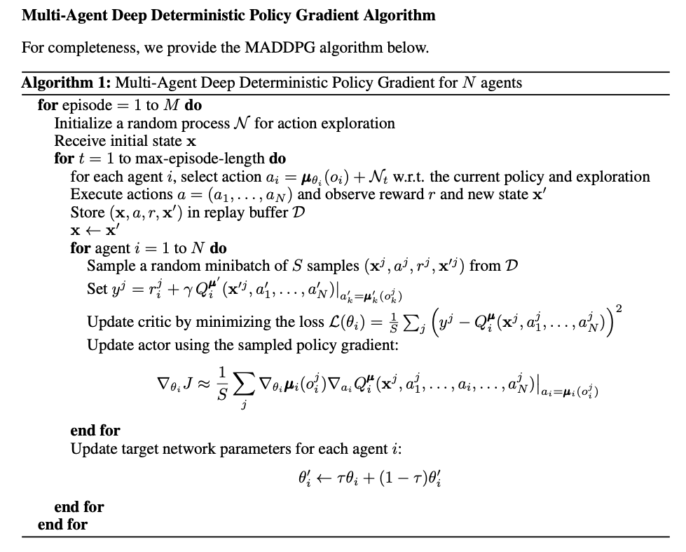
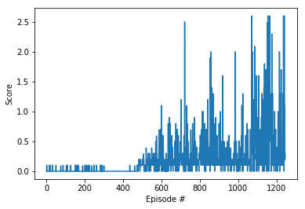

# Project 3 Report

For this project, I will work with the [Tennis](https://github.com/Unity-Technologies/ml-agents/blob/master/docs/Learning-Environment-Examples.md#tennis) environment.

In this environment, two agents control rackets to bounce a ball over a net. If an agent hits the ball over the net, it receives a reward of +0.1.  If an agent lets a ball hit the ground or hits the ball out of bounds, it receives a reward of -0.01.  Thus, the goal of each agent is to keep the ball in play.

The observation space consists of 8 variables corresponding to the position and velocity of the ball and racket. Each agent receives its own, local observation.  Two continuous actions are available, corresponding to movement toward (or away from) the net, and jumping. 

The task is episodic, and in order to solve the environment, the agents must get an average score of +0.5 (over 100 consecutive episodes, after taking the maximum over both agents). Specifically,

- After each episode, we add up the rewards that each agent received (without discounting), to get a score for each agent. This yields 2 (potentially different) scores. We then take the maximum of these 2 scores.
- This yields a single **score** for each episode.

The environment is considered solved, when the average (over 100 episodes) of those **scores** is at least +0.5.

### Learning Algorithm

The algorithim I chose for this project is the Multiple Agent Deep Deterministic Policy Gradient (MADDPG) algorithm: 

(This is a screen shot from [the original paper](https://arxiv.org/pdf/1706.02275.pdf))

The python implementation is based on Udacity's [ddpg-pendulum](https://github.com/udacity/deep-reinforcement-learning/tree/master/ddpg-pendulum) project. I upgrade my [previous project code](https://github.com/luzk-emory/Udacity-Deep-Reinforcement-Learning/tree/master/p2_continuous-control) to handle this multiple agent game, where the two agents share the same memory buffer. 

#### Neural Network Architecture 

The actor network has two hidden layers, where the 1st layer has 400 nodes and the 2n layer has 300 nodes. The critic network has a very sililar structure as the actor nework. The activation functions are all ReLus. 

The networks used here are the same as in [my previous project](https://github.com/luzk-emory/Udacity-Deep-Reinforcement-Learning/tree/master/p2_continuous-control).

#### Hyperparameters 

The key hyperparameters in mine benchmark implementation are as follows:

| Hyperparameter          | Value |
| ----------------------- | ----- |
| Replay buffer size      | 1e5   |
| Batch size              | 256   |
| GAMMA (discount factor) | 0.99  |
| TAU                     | 1e-3  |
| Actor learning rate     | 1e-4  |
| Critic learning rate    | 1e-3  |
| L2 weight decay         | 0     |
| Updating frequency      | 1     |
| Updating times          | 1     |
| OUNoise sigma           | 0.2   |

Most of the parameters are broadly in align with [my previous project](https://github.com/luzk-emory/Udacity-Deep-Reinforcement-Learning/tree/master/p2_continuous-control).

### Plot of Rewards

The rewards during the training process are plotted below:

It can be seen that after about 30 episodes of training, the score starts to converge and reach a level above 35 points. The learning speed is pretty amazing. 

### Ideas for Future Work

1. The most straiforward way is to try increasing the number of neural network layers and the number of nodes in each layer, or fine-tune other hyper parameters.
2. My current implementation is a minimum departure from singe agent DDPG, where the agents only share the memory buffer. Maybe one can try other variants of MADDPG where the agents share 
   - actor networks
   - critic networks
   - both actor networks and critic networks
3. Use Prioritized Experience Replay

### Watch the Video

???